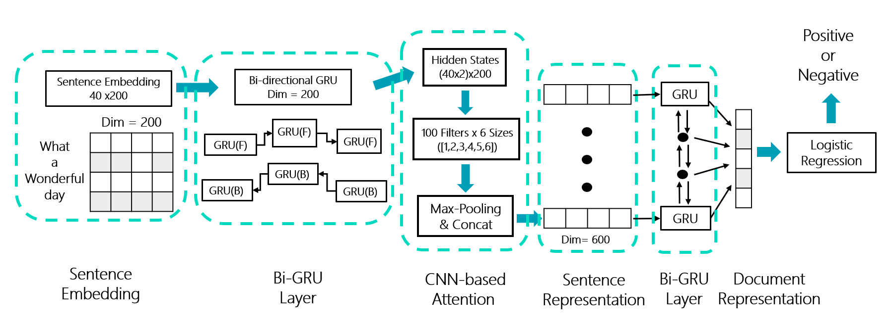
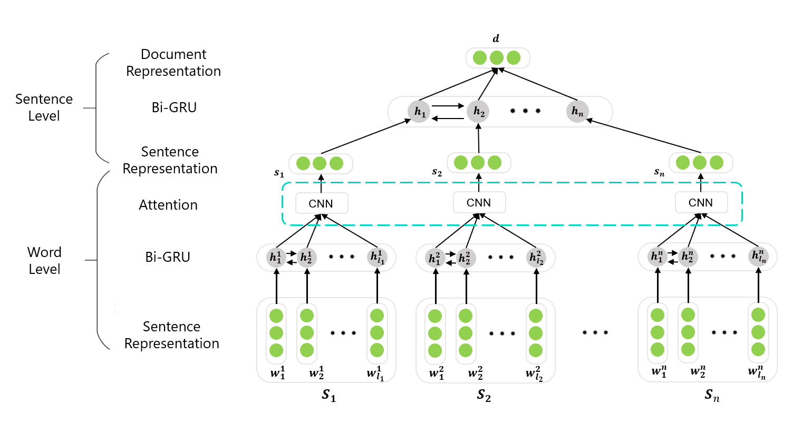
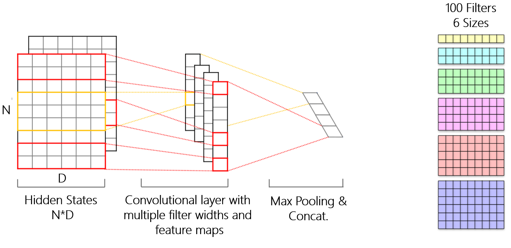

# Sentiment-Classification

## Overview

This is the code for course project of SJTU-CS438 **Internet-based Information Extraction Technologies**. For a given review on anything included in the train corpus, the model will predict its sentiment polarity(*positive/negative*).

## Dataset

The dataset contains **34639 Chinese reviews** and **13385 English reviews** on *movies*, *books*, *music* and *electronic devices* along with their annotations, which can be found in folder `/dataset`. 

## Model

- We proposed **Hierarchical Attention Network(HAN)** for sentiment classification on reviews which vary in size. We firstly converted the words into large-corpus-based word embeddings. Then we divided the reviews into sentences based on punctuations. We used a **bi-directional GRU** layer, together with a **CNN-based attention** mechanism to generate **sentence representation**. Finally we fed the sentence representation to another layer of bi-GRU to generate **document representation**. 

- The architecture of HAN is shown as follows:

  

- The hierarchical structure is shown as follows:

  

- The CNN-based attention mechanism is shown as follows:

  

  Firstly, we extracted the hidden states of the word-level bi-GRU layer and fed them into a CNN layer. We used 6 filter sizes [1,2,3,4,5,6], with 100 filters for each size. After a max-pooling layer we concatenated all outputs, creating a 600 dimensional vector as the sentence representation. 

## Dependencies

- Python 3.6
- Pytorch>=0.4.1
- Numpy

## Preparation

- Put your own word embedding in folder /word_embedding. 

- Preprocess training corpus(divide sentences and pre-calculating the embedding of corpus)

  ```
  python preprocess.py
  ```

## Training Phase

- Run the training phase 

  ```
  python main.py --train True --tag CN --model-dir trained_models
  ```

  Note that you can assign other command line parameters for training, like `language of corpus`, `learinng rate` and so son.

## Evaluating Phase

- Run the evaluating phase

  ```
  python main.py --train False --tag CN --model-dir trained_models
  ```

  Note that you should have trained models in folder /trained_models,  and the predicted polarity will be located in folder /dataset.

## Accuracy

- Chinese: 90.38%
- English: 86.25%
- Note that you may try your own word embedding or train the model with a new language.

## Examples

- **Positive**: *"This toothbrush and its replacement heads are awesome!!  your teeth feel great after every brush!!  highly recommended!"*
- **Negative**: *"I heard a lot about this product so I tried it. About a hour after giving it to my dog he started licking his feet until they were really wet.  He didn't like it in his food and wouldn't try it again later."*

## Contributors

This repo is maintained by [Han Xue](https://github.com/xiaoxiaoxh), [Kaiwen Zha](https://github.com/KaiwenZha) and [Qibing Ren](https://github.com/renqibing).
